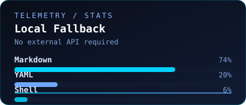
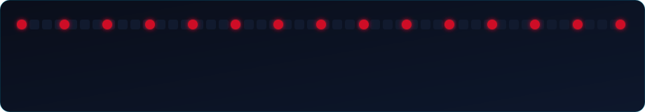

<!-- =====================================
                HEADER
===================================== -->

<div align="center">
  <a href="https://git.io/typing-svg">
    
  </a>
</div>

<!-- =====================================
              INTRODUCTION
===================================== -->

<p align="center">
  
  
  
</p>

<p align="center">
  <i>"Architecting intelligent systems and data-driven solutions for human-centered innovation."</i>
</p>

<hr>

<!-- =====================================
                ABOUT ME
===================================== -->

<a href="https://git.io/typing-svg">
  
</a>

<br/>

```yaml
[SYSTEM_LOG]:
  query   : EXECUTING_QUERY...
  result  : "Passionate about Artificial Intelligence, Software Engineering, Data Science, and Education Technology."

[ACTIVE_PROCESSES]:
  task_01 : "Developing AI & Fullstack projects."
  task_02 : "Exploring Machine Learning, System Design, and Research Engineering."
  task_03 : "Innovating in Educational Technology."
```

<hr>

<!-- =====================================
                 SKILLS
===================================== -->

<a href="https://git.io/typing-svg">
  
</a>

<br/>
<br/>

**[LOAD_DEPENDENCY: LANGUAGES]**
<p>
  
</p>

**[LOAD_DEPENDENCY: FRONTEND_INTERFACE]**
<p>
  
</p>

**[LOAD_DEPENDENCY: BACKEND_AND_DATA]**
<p>
  
</p>

**[LOAD_DEPENDENCY: TOOLING_ENVIRONMENT]**
<p>
  
</p>

<hr>

<!-- =====================================
            FEATURED PROJECTS
===================================== -->

<a href="https://git.io/typing-svg">
  
</a>

<br/>

```yaml
[FEATURED_PROJECT_01]:
  name        : "AI-Powered Assessment Platform | Affectra"
  stack       : "Python, Machine Learning, Laravel, React"
  description : "Educational assessment system featuring adaptive interaction, automated grading, and real-time analytics."

[FEATURED_PROJECT_02]:
  name        : "Data Analytics & Visualization Dashboard | FinMate"
  stack       : "TypeScript, React, Python, Data Science"
  description : "Interactive dashboard for financial data monitoring, analytics, and predictive insights."

[FEATURED_PROJECT_03]:
  name        : "Scalable Fullstack Web System | PSTIMart"
  stack       : "Laravel, MySQL, Tailwind CSS"
  description : "Modern scalable web application built with robust backend architecture and responsive UI."
```

<hr>

<!-- =====================================
               STATS
===================================== -->

 <a href="https://git.io/typing-svg">
  
</a> 

<br/>
<br/>

 <p align="center">
  
  


<p align="center">
  
  
</p>

<br/>

<!-- =====================================
                CONTRIBUTIONS SNAKE
===================================== -->

<p align="center">
  
</p>

<br/>

<!-- =====================================
                CONTACT
===================================== -->

<a href="https://git.io/typing-svg">
  
</a>

<br/>
<br/>

<p>
  <a href="https://github.com/Fikriansyah000" target="_blank">
    
  </a>
  <a href="https://www.linkedin.com/in/fikriansyah-haikal-ramadhan-820bb8235/" target="_blank">
    
  </a>
  <a href="mailto:fikriansyahhaikalr@gmail.com">
    
  </a>
</p>

<hr>

<div align="center">
  <a href="https://git.io/typing-svg">
    
  </a>
</div>
